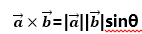

# 计算机图形学 c#实现 多边形相关算法

## 1.鼠标画多边形

画图首先需要画板，即GDI+的Graphics类。

为了在全局中使用Graphics类。

1. 首先定义全局变量

​        List<Point> pt1 = new List<Point>(); 记录鼠标点击的点坐标
​        int num1 = 0; 记录个数
​        Point mouseLocation; 记录鼠标移动的坐标
​        Graphics g; 定义画图类


2. 往界面中拖入pictureBox1，添加事件pictureBox1_Paint


3. 将picturebox1与画图类绑定，则picturebox1为我们的画板


4. 为了获得鼠标点击的坐标，在click函数中是没有e.location这个属性的，只能通过pictureBox1_MouseMove中记录下e.location。

```c++
        private void pictureBox1_MouseMove(object sender, MouseEventArgs e)
        {
            this.mouseLocation = e.Location;
        }
         private void pictureBox1_Click(object sender, EventArgs e)
        {
            if (flag && type==1)
            {
                num1++;
                pt1.Add(this.mouseLocation);
                if (num1 > 1)
                    g.DrawLine(Pens.Black, pt1[num1 - 2], pt1[num1 - 1]);//画直线
            }
        }
```

5. 右键，将多边形首尾相连，画图结束。c#和MFC不一样，MFC的左键点击和右键点击函数不一样，c#只有通过添加pictureBox1_MouseDown函数，再通过判断e.Button == MouseButtons.Right来判断


## 2.判断多边形是否有效

主要是判断多边形是否自相交

我写的逻辑可能有点复杂？不知道能不能说清楚

简单来说，就是判断两条没有公共顶点的线，其交点在不在线段上

在polygon类里定义一个isvalid函数。调用ifintersect函数，判断线段a1b1在a2b2的交点，是否在范围内

```c++
        public bool isvalid()
        {
            //至少三个顶点
            if (num < 3)
                return false;
            //判断多边形是否相交
            for(int i=0;i<num-2;i++)
            {
                for(int j=i+2;j<num;j++)
                {
                    if (i == 0 && j == num - 1)
                        //防止首尾相连的情况
                        continue;
                    if (ifintersect(pt[i], pt[i + 1], pt[j], pt[(j + 1)%num]))
                        return false;
                }
            }
            return true;
        }
        public bool ifintersect(Point p1,Point p2,Point p3,Point p4)
        {
            //求两条线段的交点
            //求k,b
            double k1 = (double)(p2.Y - p1.Y) / (p2.X - p1.X);
            double k2 = (double)(p3.Y - p4.Y) / (p3.X - p4.X);
            double b1 = p1.Y - k1 * p1.X;
            double b2 = p3.Y - k2 * p3.X;
            double delta_x = (b2 - b1) / (k1 - k2);
            double delta_y = delta_x * k2 + b2;
            if (delta_y > Math.Min(p3.Y, p4.Y) && delta_y < Math.Max(p3.Y, p4.Y))
                return true;
            else
                return false;
        }
```

## 3. 计算多边形面积

$$
\text { area }=0.5 * \sum_{i=1}^{l e n}(p[i] . x * p[i+1] . y-p[i] . y * p[i+1] . x)
$$

```c++
public double calculate_area()
        {
            double area = 0.0;
            for (int i = 0; i < num; i++)
            {
                area += (pt[i].X * pt[(i + 1)%num].Y - pt[i].Y * pt[(i + 1) % num].X);
            }
            return Math.Abs(area / 2);
        }
```

## 4. 计算多边形凹凸性

主要的想法有两个

想法1：向量点乘计算夹角，夹角相加等于(n-2)*180就是对的

想法2：向量叉乘，变成一个个三角形面积相加

我是用法二实现的，因为法一涉及到一定的误差

法二的原理在于

两个向量a和b的叉积（向量积）可以被定义为：

在这里θ表示两向量之间的角夹角（0° ≤ θ ≤ 180°），它位于这两个矢量 所定义的平面上。

area = x1 * y2 + x2 * y3 + x3 * y1 - x1 * y3 - x2 * y1 - x3 * y2

如果area和上一个area的符号相反，说明是凹多边形

```c++
        public bool cal_Convexity()
        {

            //想法1：向量点乘计算夹角，夹角相加等于(n-2)*180就是对的
            //想法2：向量叉乘，变成一个个三角形面积相加
            double area, last_area = 0.0;
            for (int i = 0; i < num; i++)
            {
                int x1 = pt[i].X;
                int y1 = pt[i].Y;
                int x2 = pt[(i + 1) % num].X;
                int y2 = pt[(i + 1) % num].Y;
                int x3 = pt[(i + 2) % num].X;
                int y3 = pt[(i + 2) % num].Y;
                area = x1 * y2 + x2 * y3 + x3 * y1 - x1 * y3 - x2 * y1 - x3 * y2;
                if ((area * last_area) < 0)
                    return true;
                last_area = area;
            }
            return false;
        }
```

## 5. 定位，判断点在多边形内还是在多边形外

对于特殊情况如射线d和g，两个的结果是不一样的

判断方法：判断线段是否在射线同一端的时候，可以留一个端点。

```c++
        public int getposition(Point p)
        {
            //水平射线法
            //正常情况与多边形的交点为偶数的话在多边形外（一进一出），奇数的话在多边形内
            //特殊情况1：点为多边形顶点，点在多边形上
            //特殊情况2：射线经过多边形顶点
            bool flag = true;
            for(int i=0;i<num;i++)
            {
                //点为多边形顶点
                if ((p == pt[i]) || (p == pt[(i + 1)%num]))
                    return 0;
                else if((p.Y>=pt[i].Y && p.Y<pt[(i+1)%num].Y) || (p.Y >= pt[(i + 1) % num].Y && p.Y < pt[i].Y))
                {
                    double x = (double)(pt[i].X - pt[(i + 1) % num].X) * (p.Y - pt[i].Y) / (pt[i].Y - pt[(i + 1) % num].Y) + pt[i].X;
                    if (Math.Abs(x - p.X) < 1e-4)
                        return 0;
                    if (x > p.X)
                        flag = !flag;
                }
            }
            return flag ? 1 : -1;
        }
```

